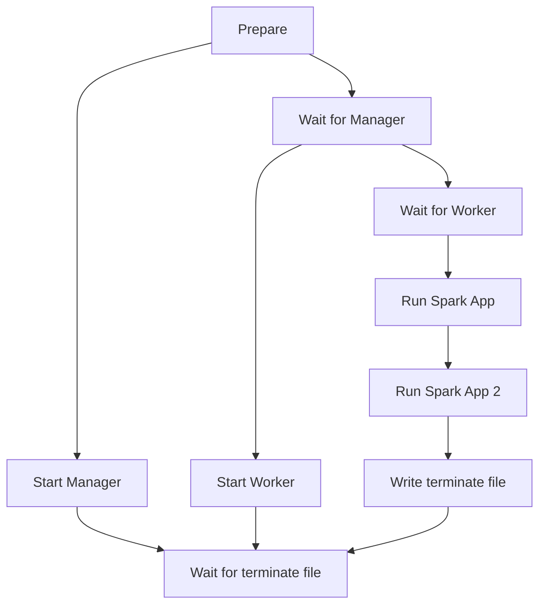

# Spark Cluster

```mermaid
flowchart TD
  PREPARE["Prepare"]
  STARTMANAGER["Start Manager"]
  WAITFORMANAGER["Wait for Manager"]
  STARTWORKER["Start Worker"]
  WAITFORWORKER["Wait for Worker"]
  RUNAPP["Run Spark App"]
  RUNAPP2["Run Spark App 2"]
  waitforterm["Wait for terminate file"]
  writeterm["Write terminate file"]
  PREPARE --> STARTMANAGER & WAITFORMANAGER
  STARTMANAGER --> waitforterm
  WAITFORMANAGER --> STARTWORKER & WAITFORWORKER
  STARTWORKER --> waitforterm
  WAITFORWORKER --> RUNAPP --> RUNAPP2 --> writeterm --> waitforterm
```
